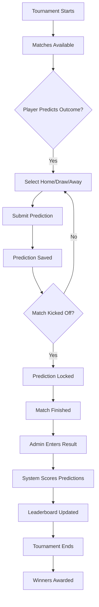

# Match Outcome Prediction Workflow

This workflow describes the process for predicting a match outcome and the subsequent scoring.

```mermaid
graph TD
    A[Tournament Starts] --> B[Matches Available]
    B --> C{Player Predicts Outcome?}
    C -- Yes --> D[Select Home/Draw/Away]
    D --> E[Submit Prediction]
    E --> F[Prediction Saved]
    F --> G{Match Kicked Off?}
    G -- No --> D
    G -- Yes --> H[Prediction Locked]
    H --> I[Match Finished]
    I --> J[Admin Enters Result]
    J --> K[System Scores Predictions]
    K --> L[Leaderboard Updated]
    L --> M[Tournament Ends]
    M --> N[Winners Awarded]
```
