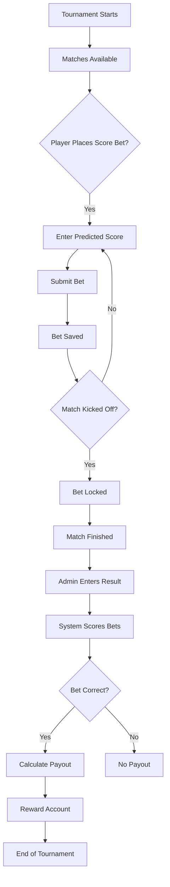

# Exact Score Betting Workflow

This workflow describes the process for placing an exact score bet and receiving a payout.

```mermaid
graph TD
    A[Tournament Starts] --> B[Matches Available]
    B --> C{Player Places Score Bet?}
    C -- Yes --> D[Enter Predicted Score]
    D --> E[Submit Bet]
    E --> F[Bet Saved]
    F --> G{Match Kicked Off?}
    G -- No --> D
    G -- Yes --> H[Bet Locked]
    H --> I[Match Finished]
    I --> J[Admin Enters Result]
    J --> K[System Scores Bets]
    K --> L{Bet Correct?}
    L -- Yes --> M[Calculate Payout]
    M --> N[Reward Account]
    L -- No --> O[No Payout]
    N --> P[End of Tournament]
```
