# Business Use Cases — Detailed Flows

> **Project:** Conarum Prediction  
> **Version:** 1.0 | **Last Updated:** 2026-02-25

---

## UC1: Exact Score Prediction (Đánh Tỉ Số)

### Actor: Employee (User)

### Preconditions
- User is logged in
- Match is in "upcoming" status
- UC1 is enabled by admin
- Betting window is still open (not within `lockBeforeMatch` minutes of kickoff)

### Main Flow

```mermaid
sequenceDiagram
    participant U as User
    participant App as Frontend
    participant API as Backend
    participant DB as Database
    participant Admin as Admin

    U->>App: Navigate to Exact Score tab
    App->>API: GET /matches?status=upcoming
    API->>DB: Query upcoming matches
    DB-->>API: Match list
    API-->>App: Matches with weights
    App-->>U: Display score prediction cards

    U->>App: Enter predicted score (e.g., 2-1)
    U->>App: Click "Save"
    App->>API: POST /score-bets { matchId, homeScore, awayScore }
    API->>DB: Validate (max bets, lock time, etc.)
    DB-->>API: OK
    API-->>App: Bet saved
    App-->>U: "Score pick saved" toast

    Note over Admin: After match ends
    Admin->>API: POST /matches/:id/result { homeScore, awayScore }
    API->>DB: Update match result
    API->>DB: Compare all score bets for this match
    API->>DB: Mark matching bets as correct
    API->>DB: Calculate payout (Base × Multiplier × Bonus − Fee)
    API-->>Admin: Results processed
```

### Business Rules Summary

| Rule | Value | Admin Configurable? |
|------|-------|---------------------|
| Max bets per match | 3 | ✅ (1–10) |
| Base bet price | 50,000 VND | ✅ |
| Base reward | 200,000 VND | ✅ |
| Allow duplicate bets on same score | Yes | ✅ |
| Duplicate multiplier | 2x | ✅ (1–10x) |
| Bonus multiplier (special events) | 1.5x | ✅ (1–5x) |
| Platform fee | 5% | ✅ (0–20%) |
| Lock before kickoff | 30 min | ✅ (0–120 min) |
| Auto-lock on kickoff | Yes | ✅ |
| Payout delay | 24h | ✅ (0–72h) |

### Exception Flows

| Exception | Handling |
|-----------|----------|
| User tries to bet after lock | Show "Betting closed" error |
| User exceeds max bets | Show "Max bets reached for this match" |
| Duplicate bet beyond max | Show "Max duplicate bets reached" |
| Invalid score (negative) | Client-side validation (0–9) |

---

## UC2: Match Outcome Prediction (Dự Đoán Thắng/Thua/Hòa) ⭐

### Actor: Employee (User)

### Preconditions
- User is logged in
- Matches are available
- UC2 is enabled by admin
- Match has not yet kicked off

### Main Flow

```mermaid
sequenceDiagram
    participant U as User
    participant App as Frontend
    participant API as Backend
    participant DB as Database
    participant Admin as Admin
    participant LB as Leaderboard Engine

    U->>App: Navigate to Match Predictions
    App->>API: GET /matches?status=upcoming
    API-->>App: Match list with weights and stages
    App-->>U: Display match cards with Win/Draw/Lose buttons

    U->>App: Pick "Home Win" for Match A
    U->>App: Pick "Draw" for Match B
    U->>App: Click "Submit Predictions"
    App->>API: POST /predictions [{ matchId, pick }]
    API->>DB: Validate (not kicked off, not already locked)
    API->>DB: Save predictions with timestamp
    API-->>App: Confirmed (locked)
    App-->>U: "Predictions submitted" success toast

    Note over U: Predictions are now IMMUTABLE

    Note over Admin: After match ends
    Admin->>API: POST /matches/:id/result { homeScore, awayScore }
    API->>DB: Determine outcome (home_win|draw|away_win)
    API->>DB: Compare all predictions for this match
    API->>DB: Calculate: BasePoints × MatchWeight + Bonuses
    API->>LB: Trigger leaderboard recalculation
    LB->>DB: Aggregate points, apply tie-break rules
    LB-->>DB: Updated rankings
    API-->>Admin: Match scored, leaderboard updated

    U->>App: Navigate to Leaderboard
    App->>API: GET /leaderboard
    API-->>App: Ranked player list
    App-->>U: Show podium + full rankings table
```

### Scoring Logic (Critical)

### Anti-Tampering Requirements

### Prize Distribution Flow

```mermaid
flowchart TD
    A[Tournament Final Ends] --> B[Admin enters last result]
    B --> C[System calculates final standings]
    C --> D{Apply tie-break rules}
    D --> E[Final Leaderboard]
    E --> F[1st Place → iPhone 15 Pro Max]
    E --> G[2nd Place → Honda Vision 2024]
    E --> H[3rd Place → MacBook Air M3]
    E --> I[4th-13th → 500,000 VND each]
    F --> J[Admin distributes prizes manually]
    G --> J
    H --> J
    I --> J
```

### Tie-Break Rules (in priority order)

1. **Head-to-Head Results**: Compare predictions accuracy on shared matches
2. **Goal Difference**: Total goal difference accuracy
3. **Total Correct Predictions**: Raw count of correct picks
4. **Earliest Join Date**: First registered wins

---

## UC3: Tournament Champion Prediction (Dự Đoán Đội Vô Địch)

### Actor: Employee (User)

### Preconditions
- User is logged in
- Betting status is "Open"
- UC3 is enabled by admin
- Current date is before lock date

### Main Flow

### Status Lifecycle

```mermaid
stateDiagram-v2
    [*] --> Open: Admin enables UC3
    Open --> Locked: Lock date reached OR manual lock
    Locked --> Closed: Tournament final ends
    Closed --> [*]: Prizes distributed

    Open: ✅ Users can submit/change predictions
    Locked: 🔒 No new predictions accepted
    Closed: 🏆 Results announced, winners determined
```

### Multiple Winners Handling

---

## Cross-Cutting Concerns

### Authentication & Authorization

| Role | Permissions |
|------|------------|
| **Employee (User)** | Make predictions, view leaderboard, manage profile |
| **Admin** | All user permissions + CRUD matches/teams/tournaments, enter results, configure use cases, view all users' predictions |

### Prediction Lifecycle (All Use Cases)

```mermaid
stateDiagram-v2
    [*] --> Draft: User starts picking
    Draft --> Submitted: User clicks "Submit"
    Submitted --> Locked: Match kicks off / deadline reached
    Locked --> Scored: Admin enters result
    Scored --> [*]: Points/payout calculated

    Draft: 📝 Can edit freely
    Submitted: 📤 Saved but editable until lock
    Locked: 🔒 Immutable
    Scored: ✅ Final result applied
```

### Notification Matrix

| Event | UC1 | UC2 | UC3 |
|-------|-----|-----|-----|
| Match available for prediction | — | ✅ | — |
| Predictions open | — | — | ✅ |
| X hours before lock/kickoff | ✅ | ✅ | ✅ |
| Match result entered | ✅ | ✅ | — |
| Tournament result announced | — | ✅ | ✅ |
| Leaderboard position change | — | ✅ | — |
