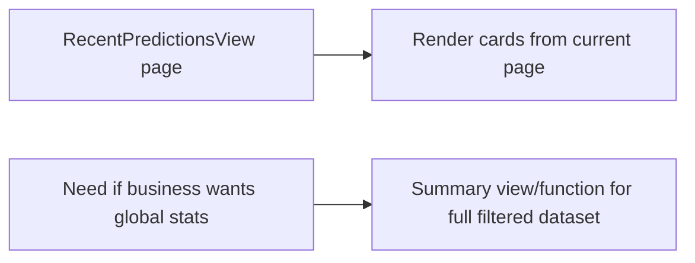
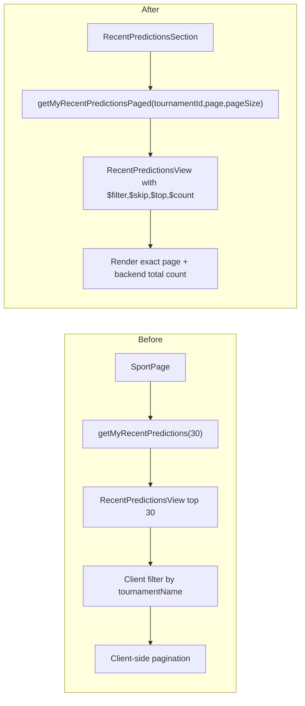

# Code Review — Recent Predictions Pagination + View Alignment

| Field | Value |
|-------|-------|
| **Date** | 260325 (v3) |
| **Reviewer** | NamVu — AI + 4-Eyes |
| **Scope** | Recent predictions flow (`SportPage`, `RecentPredictionsSection`, `playerApi`, `RecentPredictionsView`) |
| **Files Changed** | `app/internal-sport/src/pages/sport/SportPage.tsx`, `app/internal-sport/src/pages/sport/components/RecentPredictionsSection.tsx`, `app/internal-sport/src/pages/sport/sectionNavigation.ts`, `app/internal-sport/src/services/playerApi.ts`, `srv/handlers/PredictionHandler.ts`, `srv/service.cds`, `app/internal-sport/src/components/layout/LeftSidebar.tsx`, `app/internal-sport/src/components/layout/MobileBottomNav.tsx` |

---

## Code Score: **86/100** ✅

---

## Business Impact Assessment

| Area | Impact |
|------|--------|
| **Correctness** | 🟢 **Improved** — Recent predictions now reload by `tournamentId`, so switching tournament no longer shows stale top-30 cross-tournament data. |
| **Performance** | 🟢 **Improved** — Flow changed from “load fixed 30 rows once, then filter/page on client” to “load exactly 1 page from `RecentPredictionsView` with `$filter + $skip + $top + $count`”. |
| **Maintainability** | 🟢 **Improved** — Data ownership moved into `RecentPredictionsSection`, matching `CompletedMatchesTable` pattern and reducing page-level orchestration. |
| **Risk** | 🟡 **Low** — Quick stats are now page-driven except for total count. If product expects full filtered-history aggregates, a dedicated summary endpoint/view is still needed. |

---

## Actionable Findings

### 🟡 WARNING

#### W1. Quick stats are not fully global after server-side pagination
- **Where**: `RecentPredictionsSection`
- **Class or Function**: `RecentPredictionsSection`
- **Issue**: `correct`, `pending`, `accuracy`, `score bet` metrics are calculated from the currently loaded page, while `total` uses backend `totalCount`. This is acceptable for a first paging fix, but it mixes scopes.
- **Business Impact**: Users may interpret the stat cards as “all predictions in this filter” instead of “current page snapshot”.
- **Before Flow -> Need Optimize Flow**

- **Recommendation**: Add a lightweight summary view/function later if the cards must represent full filtered totals.

#### W2. `RecentPredictionsView` still enriches score bets with one extra DB batch query
- **Where**: `PredictionHandler.ts`
- **Class or Function**: `enrichRecentPredictionsView`
- **Issue**: The page data comes from a view, but score bet details are still attached in an `after READ` batch query.
- **Business Impact**: Acceptable now because it is one batched enrichment, not N+1. Still worth noting if the page later grows richer.
- **Recommendation**: Keep as-is for now. Only optimize further if real-world DB latency becomes visible.

### 🔵 LOW

#### L1. Navigation constants were correctly extracted from `SportPage`, reducing component responsibility
- **Where**: `sectionNavigation.ts`
- **Class or Function**: `SECTION`, `scrollToSection`
- **Issue**: No defect. This is a positive cleanup that removes a fast-refresh lint violation and keeps `SportPage` focused on rendering/data flow.
- **Recommendation**: Keep this split; it aligns with SRP and KISS.

#### L2. Request sequencing in recent predictions is a good defensive choice
- **Where**: `RecentPredictionsSection.tsx`
- **Class or Function**: `loadPage`
- **Issue**: No defect. `requestSequence` prevents stale async responses from overwriting newer page/tournament requests.
- **Recommendation**: Keep this pattern for other paged sections that can be reloaded rapidly.

---

## Principles Summary

| Principle | Status | Notes |
|-----------|--------|-------|
| **S** — Single Responsibility | ✅ Pass | `SportPage` no longer owns recent prediction data state; section owns its own page lifecycle |
| **O** — Open/Closed | ✅ Pass | Existing `RecentPredictionsView` was extended with `$count` support without breaking current transport style |
| **L** — Liskov Substitution | ✅ Pass | UI still consumes `RecentPredictionItem`; only fetching strategy changed |
| **I** — Interface Segregation | ✅ Pass | Navigation helpers extracted; section props are now focused on `tournamentId/enabled/refreshKey` |
| **D** — Dependency Inversion | ✅ Pass | UI depends on `playerTournamentQueryApi`, not fetch details |
| **DRY** | ✅ Pass | Recent section now follows the same server-paged pattern already used by completed matches |
| **YAGNI** | ✅ Pass | No extra endpoint was added for speculative summary logic |
| **KISS** | 🟡 Improve | Paging fix is simple and correct; only remaining complexity is stats semantics vs paged data |

---

## Verdict: **PASS** ✅

- Score: **86/100** (≥80 threshold met)
- Critical issues: **0** 🔴
- Warnings: **2** 🟡
- Low: **2** 🔵

### Flow Summary

