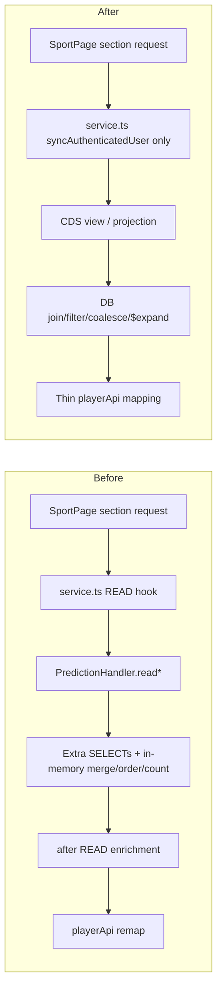

# Code Review - Prediction Read Model CDS Refactor

| Field | Value |
|-------|-------|
| **Date** | 260325 (v7) |
| **Reviewer** | NamVu - AI + 4-Eyes |
| **Scope** | Prediction sport-page read model (`PredictionHandler`, CDS views, current-user resolution, frontend API adapter) |
| **Files Changed** | `srv/service.cds`, `srv/service.ts`, `srv/handlers/PredictionHandler.ts`, `srv/lib/UserContext.ts`, `app/internal-sport/src/services/playerApi.ts` |

---

## Code Score: **93/100** PASS

---

## Business Impact Assessment

| Area | Impact |
|------|--------|
| **Performance** | Improved. Read-model work moved from TypeScript materialization to CDS joins, filters, `coalesce(...)`, and OData `$expand`, reducing server-side orchestration and duplicated queries. |
| **Maintainability** | Major improvement. About 1000 lines of custom read-path code were deleted from `PredictionHandler`, and the service layer no longer overrides standard `READ` for sport-page projections. |
| **Data Consistency** | Improved. `Leaderboard`, `Completed`, `Available`, `Recent`, `Bracket`, and `My*` views now describe one declarative source of truth instead of split CDS + after-read patch logic. |
| **Risk** | Low to medium. Current-user reads now depend on `syncAuthenticatedUser()` and `CurrentPlayerView`; the added legacy synthetic-email fallback reduces migration risk for older player records. |

---

## Actionable Findings By Severity

### CRITICAL

- None.

### WARNING

- None.

### LOW

#### L1. Current-user identity predicate is still duplicated across several CDS entities
- **Entity or Area**: `CurrentPlayerView`, `MyPredictions`, `MyScoreBets`, `MySlotPredictions`, `MySlotScoreBets`, `MyChampionPick`
- **Issue**: The `loginName/email/userUUID` matching rule now lives in CDS, which is the right direction, but the predicate is repeated in multiple entities.
- **Business Impact**: No current production bug. The risk is future drift if identity matching rules change again and one view is updated while another is missed.
- **Recommendation**: Accept for this refactor. If this area changes again, consolidate the rule around a single reusable current-user helper pattern.

#### L2. The new `$expand` score-bet path still needs one real-session smoke test
- **Entity or Area**: `AvailableMatchesView`, `RecentPredictionsView`, `playerApi`
- **Issue**: Static verification passed (`ts-typecheck`, `cds build`), but this review does not include a browser/runtime check against real user data for `myScores` and `scoreBets`.
- **Business Impact**: If an OData expansion shape drifts at runtime, users would most likely see missing predicted-score data rather than a compile-time failure.
- **Recommendation**: Run one smoke test with a user who already has match predictions and exact-score bets in the current tournament.

#### L3. Legacy synthetic-email fallback is a compatibility bridge, not the final data model
- **Entity or Area**: `syncAuthenticatedUser()` in `srv/lib/UserContext.ts`
- **Issue**: The fallback is the correct safety net for this rollout, but it also confirms that some user/player identity data is still normalized through legacy rules.
- **Business Impact**: No immediate defect. The medium-term cost is keeping compatibility logic alive longer than necessary.
- **Recommendation**: Keep it for now. If legacy player records can be normalized later, this fallback can eventually be retired.

---

## Read Path Review

### 1. Architecture direction

This refactor moves the sport-page read model to the database layer where it belongs:

- `PredictionHandler` now stays focused on actions and business rules.
- `service.ts` no longer overrides standard `READ` behavior for sport-page projections.
- `service.cds` now owns joins, current-user scoping, bracket leg fallback, and score-bet expansion surfaces.

### 2. Before vs after

- This is a real simplification, not just code movement.
- The diff is directionally strong: `201 insertions` vs `1096 deletions`.
- The refactor also removes the need for `this.on('READ', ...)` style overrides on the main sport-page projections.

### 3. What correctly remained in TypeScript

These pieces should stay out of CDS:

- mutation actions such as submit, cancel, and champion-pick flows
- business validation and orchestration logic
- operational user-sync logic before protected reads

That separation is appropriate and aligns with the stated goal: move what can move to CDS, keep imperative business logic where CDS is not the right tool.

---

## Verification Notes

- `npm run ts-typecheck` - PASS
- `npm run build:cds` - PASS

---

## Principles Summary

| Principle | Status | Notes |
|-----------|--------|-------|
| **S - Single Responsibility** | PASS | CDS owns read-model shape; handler owns mutations and rules. |
| **O - Open/Closed** | PASS | New helper views were added without extending the old read-hook pattern. |
| **L - Liskov Substitution** | PASS | Frontend still consumes the same sport-page concepts after the refactor. |
| **I - Interface Segregation** | PASS | `playerApi` now depends on narrow view contracts and `$expand` payloads instead of orchestration helpers. |
| **D - Dependency Inversion** | PASS | UI remains behind service-layer helpers instead of binding directly to raw CDS internals. |
| **DRY** | IMPROVE | Current-user predicates are still repeated across several views. |
| **YAGNI** | PASS | Large custom `READ` logic was removed instead of being kept as parallel fallback code. |
| **KISS** | PASS | The overall data flow is materially simpler than the previous handler-heavy path. |

---

## Verdict

- **Result**: PASS
- **Score**: 93/100
- **Critical**: 0
- **Warnings**: 0
- **Low**: 3

### Final Assessment

- The refactor lands on the right architecture: CDS-first read models, thinner service hooks, and a prediction handler focused on actions instead of query shaping.
- The risky part of the migration, current-user resolution, was handled carefully with pre-read sync plus a fallback for legacy synthetic-email players.
- No blocking issue was found in this review. The only remaining ask before closing the loop is one runtime smoke test on real prediction and score-bet data.
