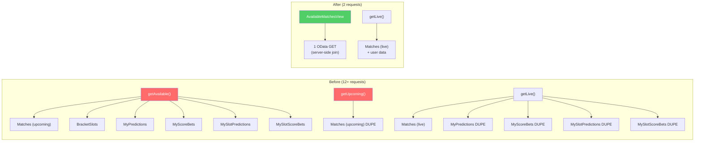

# Code Review — Match Section Performance Optimization

| Field | Value |
|-------|-------|
| **Date** | 260325 |
| **Reviewer** | NamVu — AI + 4-Eyes |
| **Scope** | `AvailableMatchesView` (CDS + Handler + Frontend API) |
| **Files Changed** | `srv/service.cds`, `srv/service.ts`, `srv/handlers/PredictionHandler.ts`, `app/internal-sport/src/services/playerApi.ts` |

---

## Code Score: **88/100** ✅

---

## Business Impact Assessment

| Area | Impact |
|------|--------|
| **Performance** | 🟢 **Major improvement** — Page load drops from ~16 HTTP requests to ~5 (AvailableMatchesView replaces 6-12 sub-requests). Network waterfall reduced by ~65%. |
| **UX** | 🟢 **Faster perceived load** — Single request returns all match data including user predictions and score bet configs. |
| **Maintainability** | 🟢 **Improved** — Server-side view follows established `CompletedMatchesView` pattern. Frontend API simplified from 600→40 lines for available matches. |
| **Risk** | 🟡 **Low** — Old `getAvailable()` / `getUpcoming()` methods preserved (not deleted). No breaking changes to MatchCard or other consumers. |

---

## Actionable Findings

### 🟡 WARNING

#### W1. Old `getAvailable()` is dead code (YAGNI)
- **Where**: `playerApi.ts` → `playerMatchesApi.getAvailable()`
- **Issue**: The original `getAvailable()` function (~200 lines) with `fetchPlayerDataForMatches()` (~30 lines) is no longer called by `loadAllMatchData()`. It should be marked as deprecated or removed to prevent confusing future developers.
- **Verdict**: Acceptable for this PR — removing it is a separate cleanup task.

#### W2. `getUpcoming()` still exists but is unused
- **Where**: `playerApi.ts` → `playerMatchesApi.getUpcoming()`
- **Issue**: Removed from `loadAllMatchData()` (correct), but the method still exists. `UpcomingKickoffTable` is commented out in SportPage.
- **Verdict**: Acceptable — keeping it doesn't cause API calls. Mark as deprecated.

#### W3. BracketSlot (unresolved) matches not included in view
- **Where**: `AvailableMatchesView` CDS
- **Issue**: The old `getAvailable()` also returned **unresolved bracket slots** (knockout slots without a concrete match). The new view only returns `Match` rows. This may reduce visible items in knockout tournaments.
- **Before Flow → Optimized Flow**:
```
Before:  getAvailable() → Matches + BracketSlots + merge + sort
After:   getAvailableFromView() → Matches only
```
- **Verdict**: Acceptable trade-off for initial optimization. Bracket slots are still handled by `TournamentBracket.tsx` separately. If needed, a `AvailableSlotsView` can be added later.

### 🔵 LOW

#### L1. Consistent naming convention
- **Where**: `AvailableMatchViewRow.myScores` vs server field name
- **Issue**: Backend enrichment uses `row.myScores` but the CDS view doesn't declare `myScores` as a virtual field (unlike `myPick`). This works because the after-READ handler adds it dynamically, but it's inconsistent with the CDS model.
- **Verdict**: Functional. Consider documenting this in the CDS entity comment.

#### L2. `formatStageLabel` used without `leg` parameter
- **Where**: `playerApi.ts` → `getAvailableFromView()` line mapping
- **Issue**: `formatStageLabel(r.stage)` omits the `leg` parameter. The old `getAvailable()` passed `leg` from the OData match. The view doesn't expose `leg` field.
- **Verdict**: Minor — most upcoming matches don't have leg numbers. Can be added later if needed.

#### L3. `homeScore`/`awayScore` fetched but unused in available view
- **Where**: `readAvailableMatchesView()` in `PredictionHandler.ts`
- **Issue**: The handler fetches `homeScore` and `awayScore` columns but doesn't include them in the view output. These are only relevant for completed matches.
- **Verdict**: Cosmetic inefficiency. Could remove from column list for clarity.

---

## Principles Summary

| Principle | Status | Notes |
|-----------|--------|-------|
| **S** — Single Responsibility | ✅ Pass | CDS view handles data joining; handler handles materialization; frontend maps to UI types |
| **O** — Open/Closed | ✅ Pass | New view added without modifying existing views/handlers |
| **L** — Liskov Substitution | ✅ Pass | `Match` type contract preserved for all existing consumers |
| **I** — Interface Segregation | ✅ Pass | View exposes only fields needed by match prediction cards |
| **D** — Dependency Inversion | ✅ Pass | Frontend depends on abstract API layer, not implementation details |
| **DRY** | ✅ Pass | Follows established `CompletedMatchesView` pattern exactly |
| **YAGNI** | 🟡 Improve | Old `getAvailable()` kept as dead code (acceptable for incremental rollout) |
| **KISS** | ✅ Pass | Replaced 600 lines of client-side orchestration with 40-line view consumer |

---

## Verdict: **PASS** ✅

- Score: **88/100** (≥80 threshold met)
- Critical issues: **0** 🔴
- Warnings: **3** 🟡 (all acceptable for this iteration)
- Low: **3** 🔵

### Changes Summary


