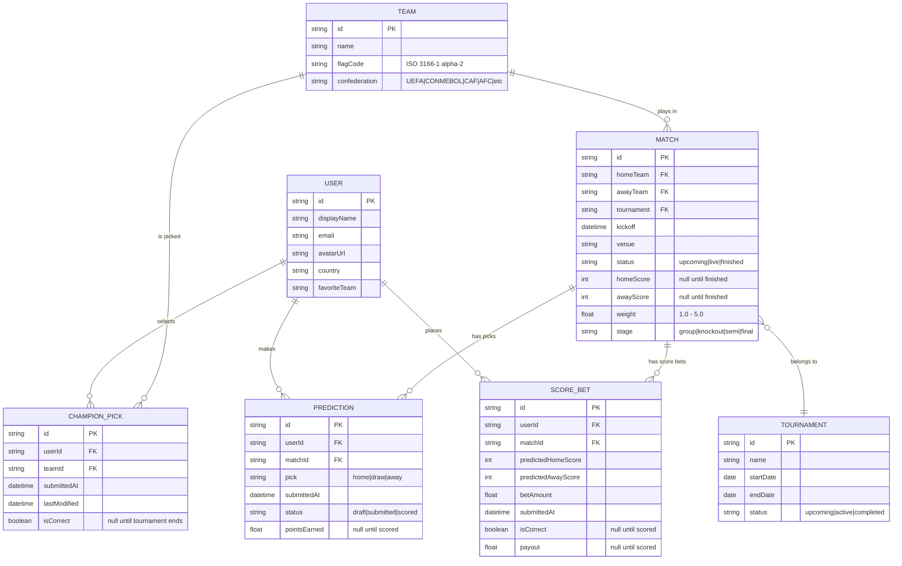

# Product Requirements Document (PRD)

> **Project:** Conarum Prediction — Internal Sport Prediction Platform  
> **Tournament:** FIFA World Cup 2026  
> **Version:** 1.0  
> **Last Updated:** 2026-02-25  
> **Owner:** BA Team / Project Team

---

## 1. Executive Summary

Conarum Prediction is an **internal company sport prediction platform** designed for World Cup 2026. Employees participate in three prediction games to compete for real prizes (cash, electronics). The platform has two interfaces:

- **User App** (`internal-sport`): Employees make predictions, view leaderboards, manage profile
- **Admin Panel**: Admins manage matches, configure rules, enter results, control scoring

---

## 2. Core Use Cases

### 2.1 Use Case 1 — Exact Score Prediction (Đánh Tỉ Số)

| Attribute | Detail |
|-----------|--------|
| **Goal** | Predict the exact final score of a match |
| **Reward Type** | Cash (VND) |
| **Max Picks per Match** | 2–3 scores (admin configurable, default: 3) |
| **Base Reward** | 200,000 VND per correct prediction |
| **Duplicate Bet Rule** | If a user puts multiple bets on the same score → reward is **multiplied** (x2 by default) |

#### Business Rules

1. Each user can submit up to `maxBetsPerMatch` score predictions per match (default: **3**)
2. **Base Price** per bet: 50,000 VND
3. **Base Reward** for a correct prediction: 200,000 VND
4. **Duplicate Bet Multiplier**: If `allowDuplicateBets` is enabled (default: yes):
   - User may bet on the same score up to `maxDuplicates` times (default: 3)
   - If that score is correct, reward is multiplied: `Reward = Base Reward × Duplicate Multiplier × Bonus Multiplier − Platform Fee`
5. **Bonus Multiplier** for special events (finals, derby): 1.5x (admin configurable)
6. **Platform Fee**: 5% deducted from winnings (admin configurable, 0–20%)
7. **Payout Delay**: 24 hours after match ends (for score corrections)
8. **Auto-lock on kickoff**: Bets are locked when the match starts
9. **Lock before match**: Stop accepting bets 30 minutes before kickoff

#### Reward Calculation Formula

```
Reward = BaseReward × DuplicateMultiplier × BonusMultiplier × (1 − PlatformFee/100)
```

**Example:** User bets on score 2–1 twice and wins:
```
= 200,000 × 2 × 1.5 − 5% = 570,000 VND
```

#### User Flow

1. User goes to **Exact Score** tab
2. Sees list of upcoming matches with score input fields
3. Enters predicted score (Home : Away) for up to 3 matches
4. Clicks **Save** → prediction is stored
5. After match ends → admin enters final score → system compares → if exact match → payout

---

### 2.2 Use Case 2 — Match Outcome Prediction (Dự Đoán Thắng/Thua/Hòa) ⭐ CORE

| Attribute | Detail |
|-----------|--------|
| **Goal** | Predict Win / Draw / Lose for every match |
| **Reward Type** | Points-based → Season prize |
| **Grand Prize** | iPhone 15 Pro Max (35,000,000 VND) |
| **Engagement** | Highest — runs throughout entire tournament |

> [!IMPORTANT]
> This is the **primary and most complex use case**. It requires tamper-proof tracking, accurate scoring, and a real-time leaderboard.

#### Point System

| Prediction Result | Base Points |
|-------------------|-------------|
| ✅ Correct (Win/Draw/Lose predicted correctly) | **3 pts** |
| 🤝 Partial (Draw predicted when result was close) | **1 pt** |
| ❌ Wrong | **0 pts** |

#### Match Weight Configuration

Not all matches are equal. Admin assigns weight multipliers:

| Match Type | Weight Multiplier | Example Points (Correct = 3 base) |
|------------|-------------------|------------------------------------|
| Regular (Group Stage) | **1x** | 3 pts |
| Important (Key Group Match) | **2x** | 6 pts |
| Semi-Final | **3x** | 9 pts |
| 🏆 Final | **5x** | 15 pts |

**Formula:**
```
Total Points = Base Points × Match Weight + Bonus Points
```

#### Bonus Rules

| Bonus | Points |
|-------|--------|
| Perfect Week (all correct in a week) | +5 pts |
| Consecutive Wins Bonus | +2 pts per streak |

**Example:** Correct prediction on Final match + 5-game win streak:
```
= 3 × 5 + (2 × 5) = 25 points
```

#### Prize Configuration (End of Season)

| Rank | Prize | Est. Value (VND) |
|------|-------|-------------------|
| 🥇 1st Place | iPhone 15 Pro Max | 35,000,000 |
| 🥈 2nd Place | Honda Vision 2024 | 30,000,000 |
| 🥉 3rd Place | MacBook Air M3 | 25,000,000 |
| 4th–13th | Consolation (cash) | 500,000 each |

#### Tie-Break Rules

When players have equal points, ranking is determined by:
1. **Head-to-Head Results** (default)
2. Goal Difference (alternative)
3. Total Correct Predictions (alternative)
4. Earliest Join Date (fallback)

#### Integrity Requirements

> [!CAUTION]
> **Anti-Tampering Rules** — Critical for UC2 fairness:

1. **Prediction Lock**: Once a match kicks off, predictions are **permanently locked**. No edits allowed.
2. **Result Entry**: Only admin can enter match results. No user can modify results.
3. **Auto-Calculate**: Points are calculated automatically 2 hours after match ends (configurable delay for score corrections).
4. **Audit Trail**: Every prediction submission has a timestamp. Late edits are rejected by the system.
5. **Live Leaderboard**: Rankings update every 5 minutes (configurable). All users can see standings.

#### User Flow

1. User goes to **Match Predictions** tab → sees upcoming matches
2. For each match, picks **Home Win / Draw / Away Win**
3. Clicks **Submit Predictions** → predictions are locked in the slip
4. During match → live score shown (if enabled)
5. After match → admin enters final result → system auto-scores
6. Leaderboard updates → user sees rank change
7. End of season → prizes awarded based on final standings

---

### 2.3 Use Case 3 — Tournament Champion Prediction (Dự Đoán Đội Vô Địch)

| Attribute | Detail |
|-----------|--------|
| **Goal** | Predict which team wins the entire tournament |
| **Timing** | Must be submitted before tournament starts |
| **Reward Type** | Prizes for correct guessers |

#### Business Rules

1. Each user picks **1 team** as their champion (admin configurable, max 1–5)
2. Prediction window: **Open Date → Lock Date** (e.g., June 1 → June 14)
3. After lock date, no changes are allowed
4. **Betting Status**: Admin controls 3 states:
   - 🟢 **Open** — Accepting predictions
   - 🟡 **Locked** — No new predictions (tournament in progress)
   - 🔴 **Closed** — Tournament ended, results announced
5. **Allow Changes**: Users can modify their pick before `changeDeadline` (default: yes)
6. **Auto-lock on tournament start**: Optional toggle

#### Prize Configuration

| Prize | Item | Value (VND) |
|-------|------|-------------|
| 🏆 Grand Prize | iPhone 15 Pro Max 256GB | 35,000,000 |
| 🥈 2nd Prize (Random Draw) | iPad Pro 12.9" | 25,000,000 |
| 🥉 3rd Prize (Random Draw) | AirPods Pro 2 | 7,000,000 |

#### Multiple Winners Handling

- **Split Prize if Tie**: If multiple people pick the correct champion → prize is split (max 5 winners)
- **Cash Alternative**: Winners can choose cash instead of physical prize (30,000,000 VND)

#### Notification System

| Event | Notification |
|-------|-------------|
| Predictions open | ✅ Notify all users |
| Before lock deadline | ✅ Reminder X hours before (default: 24h) |
| Tournament result announced | ✅ Winner announcement |

#### User Flow

1. User goes to **Tournament Champion** tab
2. Sees all participating teams in a grid (with flags, confederation labels)
3. Clicks **Select** on their chosen team
4. Confirms in dialog → prediction saved
5. Can change until lock date
6. After tournament final → champion revealed → winners announced

---

## 3. User Interface — Pages Overview

### 3.1 User App Pages

| Page | Route | Description | Use Case |
|------|-------|-------------|----------|
| Available Matches | `/available` | Match cards with Win/Draw/Lose picker | UC2 |
| Completed Matches | `/completed` | Locked picks (no editing) | UC2 |
| Tournament Champion | `/tournament-champion` | Team selection grid | UC3 |
| Exact Score | `/exact-score` | Score input cards + summary table | UC1 |
| My Predictions | `/my-predictions` | All user picks (submitted + draft) | All |
| Leaderboard | `/leaderboard` | Top-3 podium + full rankings table | UC2 |
| Account | `/account` | Profile, avatar, edit form | — |

### 3.2 Admin Panel Pages

| Page | Description |
|------|-------------|
| **Match Management** | CRUD matches (home/away team, tournament, date, time, venue, status) |
| **Team Management** | CRUD teams |
| **Player Management** | Manage registered users/participants |
| **Tournament Management** | CRUD tournaments |
| **Use Case 1 Config** | Enable/disable, pricing, reward formula, multipliers |
| **Use Case 2 Config** | Point system, match weights, prizes, bonuses, tie-break |
| **Use Case 3 Config** | Betting status, timing dates, champion prizes, notification |
| **Use Case Dashboard** | Overview of all 3 use cases with toggle controls |

---

## 4. Key Business Constraints

| Constraint | Description |
|------------|-------------|
| **Internal Only** | Platform is for company employees only, not public |
| **Currency** | VND (Vietnamese Dong) for all monetary values |
| **Manual Results** | Match results are entered manually by admin (no live data feed in v1) |
| **No Realtime Scoring** | Leaderboard updates on interval, not instant |
| **Admin-Controlled Prizes** | All prize distribution handled manually by admin after season ends |
| **Prediction Immutability** | Once locked (kickoff or deadline), predictions cannot be changed |

---

## 5. Data Entities



---

## 6. Non-Functional Requirements

| Requirement | Target |
|-------------|--------|
| **Users** | ~50–200 internal employees |
| **Availability** | During tournament period (June–July 2026) |
| **Response Time** | < 2s for all pages |
| **Browser Support** | Chrome, Edge, Safari (latest) |
| **Mobile** | Responsive design with mobile bottom nav |
| **Security** | Internal SSO / XSUAA authentication |
| **Deployment** | SAP BTP Cloud Foundry |

---

## 7. Glossary

| Term | Definition |
|------|-----------|
| **Match Weight** | Multiplier assigned to a match based on importance (1x–5x) |
| **Base Points** | Points earned for a correct prediction before weight multiplication |
| **Duplicate Bet** | Placing multiple score predictions on the same exact score |
| **Prediction Slip** | The sidebar showing current selections before submission |
| **Auto-Lock** | Automatic locking of predictions when a match kicks off |
| **Tie-Break Rule** | Method to determine ranking when players have equal points |
| **Platform Fee** | Percentage deducted from UC1 winnings |
