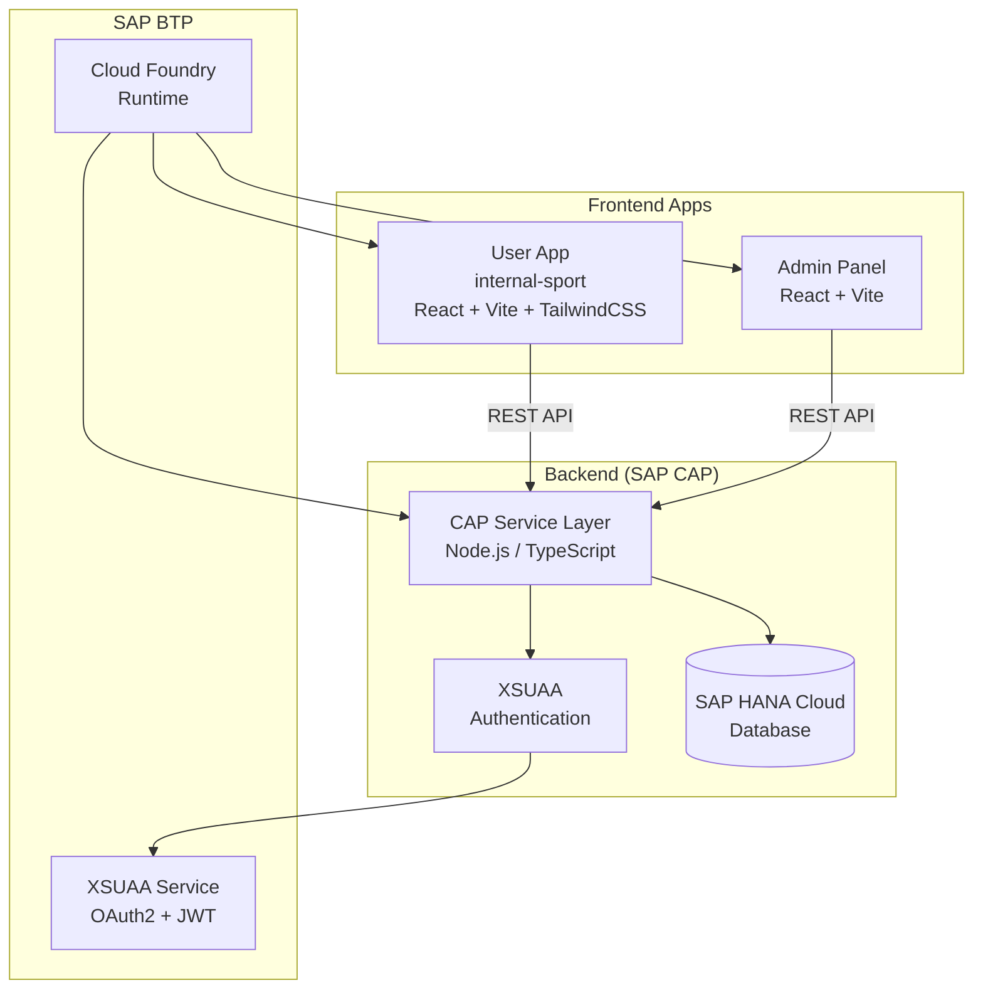

# System Overview

**Conarum Prediction** is a full-stack web application built on the **SAP Cloud Application Programming Model (CAP)**. It provides a platform for internal company employees to participate in sports prediction games.

## Tech Stack

### Backend
- **Framework:** SAP CAP (Node.js)
- **Language:** TypeScript
- **Database:** SAP HANA Cloud (Production), SQLite (Development)
- **Authentication:** SAP BTP XSUAA (OAuth2 / JWT)
- **Runtime:** SAP BTP Cloud Foundry

### Frontend
- **Framework:** React 19
- **Build Tool:** Vite 7
- **Language:** TypeScript
- **Styling:** TailwindCSS 4
- **Components:** Radix UI / shadcn/ui
- **Icons:** Lucide React, flag-icons
- **Animations:** Framer Motion
- **Routing:** React Router 7

## High-Level Architecture

## Key Components

### 1. User Application (`app/internal-sport`)
The main interface for employees to:
- Browse upcoming and completed matches.
- Submit match outcome predictions and exact score bets.
- Pick tournament champions.
- View the real-time leaderboard and player profiles.
- Manage their personal account and preferences.

### 2. Admin Panel
A dedicated interface for administrators to:
- Manage tournament master data (Tournaments, Teams, Matches).
- Enter match results and trigger the scoring engine.
- Configure business rules and reward formulas for each game.
- Monitor player activity and manage accounts.

### 3. CAP Service Layer (`srv/`)
The backend core that handles:
- **PlayerService:** Provides APIs for the User App, including prediction submission and profile management.
- **AdminService:** Provides administrative APIs for data management and system configuration.
- **Scoring Engine:** Automatically calculates points and rewards based on match results and business rules.
- **Data Synchronization:** Integrates with external APIs (e.g., football-data.org) to sync match schedules and results.

### 4. Database Layer (`db/`)
The persistence layer defining the data model for all entities, including tournaments, matches, teams, players, and their respective predictions and stats.
