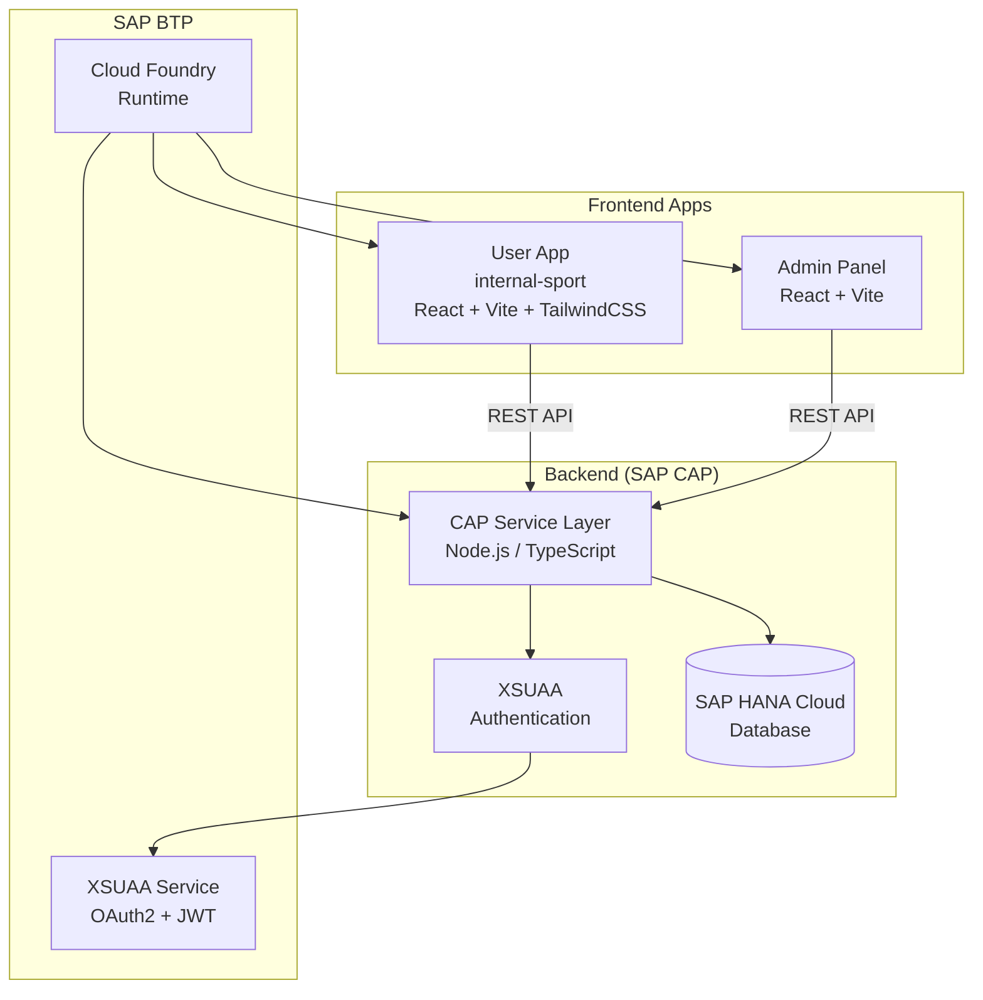
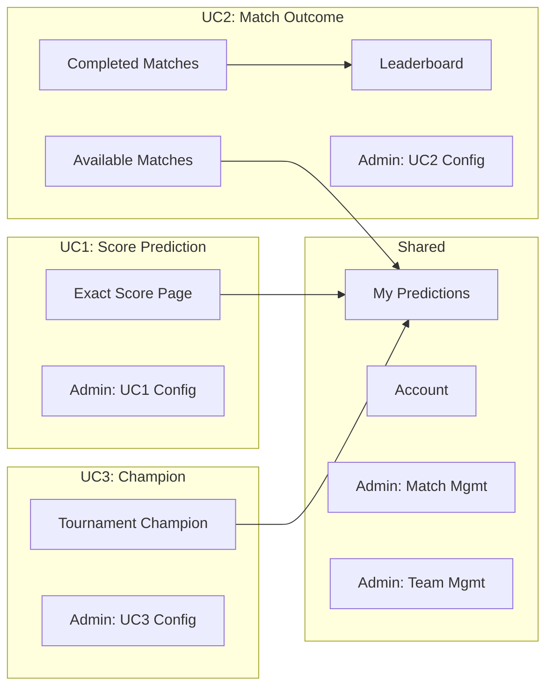
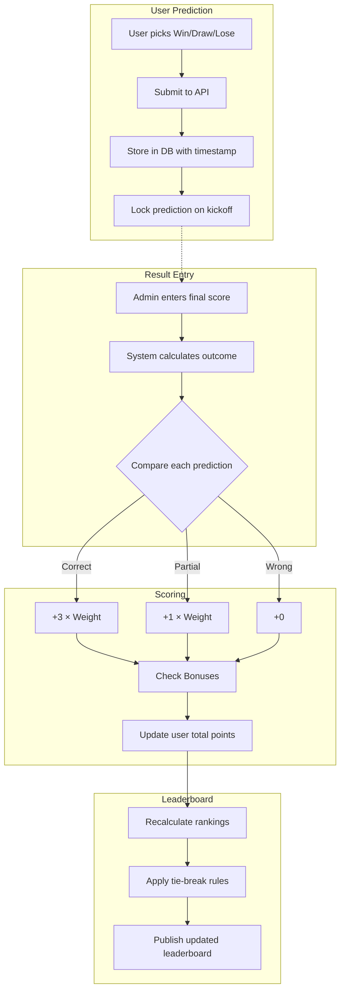

# System Architecture Overview

> **Project:** Conarum Prediction  
> **Version:** 1.0 | **Last Updated:** 2026-02-25

---

## 1. High-Level Architecture



---

## 2. Application Structure

### 2.1 User App (`app/internal-sport`)

```
internal-sport/
├── src/
│   ├── components/           # Reusable UI components
│   │   ├── Header.tsx            # Top nav with route-aware mode tabs
│   │   ├── LeftSidebar.tsx       # Context-aware filters & status
│   │   ├── PredictionSlip.tsx    # Right panel: prediction basket
│   │   ├── MatchCard.tsx         # Match card with Win/Draw/Lose picker
│   │   ├── LiveMatchesTable.tsx  # Live match scores table
│   │   ├── UpcomingKickoffTable.tsx  # Upcoming matches table
│   │   ├── MobileBottomNav.tsx   # Mobile navigation bar
│   │   └── ui/                   # shadcn/ui primitives
│   │
│   ├── pages/                # Route-level pages
│   │   ├── AvailableMatchesPage.tsx    # UC2: Pick winners
│   │   ├── CompletedMatchesPage.tsx    # UC2: Locked picks
│   │   ├── ExactScorePage.tsx          # UC1: Score predictions
│   │   ├── TournamentChampionPage.tsx  # UC3: Champion selection
│   │   ├── MyPredictionsPage.tsx       # All: Prediction history
│   │   ├── LeaderboardPage.tsx         # UC2: Rankings
│   │   └── AccountPage.tsx             # Profile management
│   │
│   ├── layouts/
│   │   └── AppShell.tsx        # 3-panel desktop layout
│   │
│   ├── data/
│   │   └── mockData.ts         # Mock data for development
│   │
│   ├── types/
│   │   └── index.ts            # TypeScript interfaces
│   │
│   ├── App.tsx                 # React Router setup
│   ├── main.tsx                # Entry point + Sonner toaster
│   └── index.css               # Design system (CSS variables)
│
├── vite.config.ts              # Vite + Tailwind v4 + path alias
└── package.json
```

### 2.2 Admin Panel (`app/ref-project2/sport-betting-ui`)

```
admin/
├── MatchManagement.jsx         # CRUD matches
├── TeamManagement.jsx          # CRUD teams
├── PlayerManagement.jsx        # User management
├── TournamentManagement.jsx    # Tournament CRUD
├── UseCaseConfig.jsx           # UC overview dashboard
├── UseCase1Config.jsx          # UC1 settings (score prediction)
├── UseCase2Config.jsx          # UC2 settings (match outcome)
├── UseCase3Config.jsx          # UC3 settings (champion)
└── AdminPages.css              # Admin-specific styles
```

---

## 3. Technology Stack

### Frontend

| Technology | Purpose |
|-----------|---------|
| **React 19** | UI framework |
| **Vite** | Build tool + dev server |
| **TypeScript** | Type safety |
| **Tailwind CSS v4** | Utility-first styling |
| **shadcn/ui** | Component library (Button, Dialog, Checkbox, etc.) |
| **React Router v6** | Client-side routing |
| **Sonner** | Toast notifications |
| **Lucide React** | Icon library |
| **flag-icons** | Country flag icons (CSS-based) |

### Backend (Planned)

| Technology | Purpose |
|-----------|---------|
| **SAP CAP (Node.js)** | Application framework |
| **TypeScript** | Backend language |
| **SAP HANA Cloud** | Database |
| **XSUAA** | Authentication/Authorization |
| **Cloud Foundry** | Deployment runtime |

---

## 4. Page-to-Use-Case Mapping



---

## 5. Data Flow — UC2 Scoring Pipeline (Most Critical)



---

## 6. API Endpoints (Planned)

### Matches

| Method | Endpoint | Description |
|--------|----------|-------------|
| `GET` | `/api/matches` | List matches (filter: status, stage) |
| `GET` | `/api/matches/:id` | Match detail |
| `POST` | `/api/matches` | Create match (admin) |
| `PUT` | `/api/matches/:id` | Update match (admin) |
| `PUT` | `/api/matches/:id/result` | Enter match result (admin) |
| `DELETE` | `/api/matches/:id` | Delete match (admin) |

### Predictions (UC2)

| Method | Endpoint | Description |
|--------|----------|-------------|
| `GET` | `/api/predictions` | User's predictions |
| `POST` | `/api/predictions` | Submit predictions |
| `GET` | `/api/predictions/history` | All predictions with results |

### Score Bets (UC1)

| Method | Endpoint | Description |
|--------|----------|-------------|
| `GET` | `/api/score-bets` | User's score predictions |
| `POST` | `/api/score-bets` | Place score bet |
| `GET` | `/api/score-bets/results` | Score bets with payouts |

### Champion Prediction (UC3)

| Method | Endpoint | Description |
|--------|----------|-------------|
| `GET` | `/api/champion-prediction` | User's champion pick |
| `POST` | `/api/champion-prediction` | Submit/update champion pick |
| `GET` | `/api/champion-prediction/status` | Current betting status |
| `PUT` | `/api/champion-prediction/status` | Update status (admin) |
| `PUT` | `/api/champion-prediction/result` | Set champion result (admin) |

### Leaderboard

| Method | Endpoint | Description |
|--------|----------|-------------|
| `GET` | `/api/leaderboard` | Current rankings |
| `GET` | `/api/leaderboard/podium` | Top 3 players |

### Admin Config

| Method | Endpoint | Description |
|--------|----------|-------------|
| `GET` | `/api/admin/config/uc1` | UC1 configuration |
| `PUT` | `/api/admin/config/uc1` | Update UC1 config |
| `GET` | `/api/admin/config/uc2` | UC2 configuration |
| `PUT` | `/api/admin/config/uc2` | Update UC2 config |
| `GET` | `/api/admin/config/uc3` | UC3 configuration |
| `PUT` | `/api/admin/config/uc3` | Update UC3 config |

---

## 7. Design System

### Color Themes

The app supports theme switching via CSS variables in `index.css`:

**Current Theme: Dark Purple**
| Token | Value | Usage |
|-------|-------|-------|
| `--background` | `#111122` | Page background |
| `--card` | `#1e1e38` | Card surfaces |
| `--primary` | `#6d3fc7` | Primary actions, active states |
| `--secondary` | `#8b5cf6` | Secondary actions |
| `--accent` | `#b57cff` | Accent highlights |
| `--success` | `#34d399` | Points, positive values |
| `--border` | `#3a3a5a` | Borders, dividers |

### Layout Strategy

```
┌─────────────────────────────────────────────────────┐
│  HEADER (Logo, Nav Links, Mode Tabs, Account)       │
├──────────┬──────────────────────┬────────────────────┤
│          │                      │                    │
│  LEFT    │    MAIN CONTENT      │   PREDICTION SLIP  │
│ SIDEBAR  │   (Page Content)     │   (Right Panel)    │
│  240px   │    Flexible          │     320px          │
│          │                      │                    │
├──────────┴──────────────────────┴────────────────────┤
│  MOBILE BOTTOM NAV (xl: hidden)                      │
└──────────────────────────────────────────────────────┘
```

### Responsive Breakpoints

| Breakpoint | Layout |
|-----------|--------|
| < 1024px | Sidebar hidden, stack layout |
| < 1280px | Prediction slip hidden |
| ≥ 1280px | Full 3-panel layout |
| All sizes | Mobile bottom nav on < xl |

---

## 8. Security Considerations

| Concern | Mitigation |
|---------|-----------|
| **Prediction Tampering** | Server-side lock on kickoff, reject late submissions |
| **Result Manipulation** | Admin-only result entry, audit trail |
| **Unauthorized Access** | XSUAA/OAuth2 authentication required |
| **Role Escalation** | XSUAA scope-based authorization (user vs admin) |
| **Data Integrity** | Immutable prediction records after lock |
| **CSRF** | CSRF tokens on all mutation endpoints |
